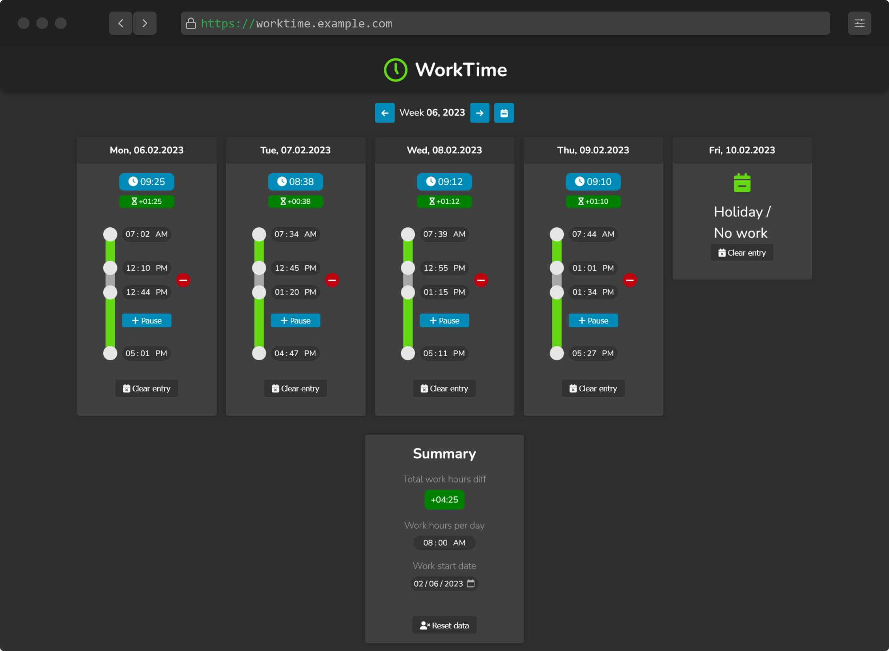

# WorkTime

This tool enables you to enter and keep track of your worked times for each day.

## Features

- Adding worked times for a date
- Dynamically adding (multiple) pauses for each day
- Adding holiday entries
- Setting the work-start-day & amount of targeted work-hours per day
- Summary of the total missing / overtime hours

## Deploying

1. Build the project: `npm run build`
1. Deploy the generated build to the server
